# Example python scripts

### Short summary
Scripts have been tested in Eve-ng network simulator environment. Eve-ng topology is stored in **eveng/** directory. I used eve-ng pro version. Please use Python virutal environments to not mess up with your workstation/management system. For nornir_scrapli framework  is desired to define inventory structure which consists **hosts.yaml,  groups.yaml, config.yaml and defaults.yaml** and this is used for this demonstraton and I don't hide credentials just for simplicity. There are better solutions for passing credentials to use those for python script in production enviornment like getppass library or credential manager. For 

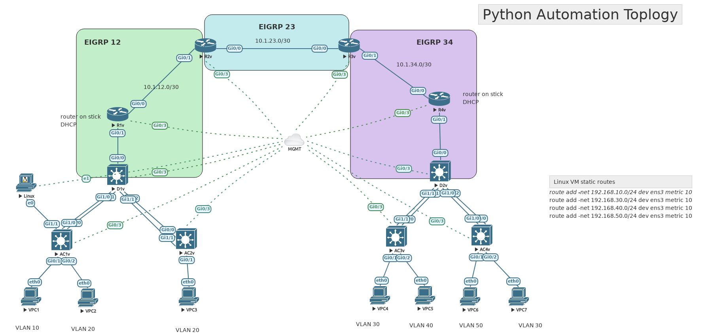

#### Please use Python venv
`source venv/bin/activate`

#### Inventory
config_vios.yaml 
```yaml
---

inventory:
    plugin: SimpleInventory
    options:
        host_file: "hosts_vios.yaml"
        group_file: "groups_vios.yaml"
        defaults_file: "defaults_vios.yaml"
        
connection_options:   
    scrapli:
      platform: cisco_iosxe
      extras:
        auth_strict_key: False
        transport: system
        transport_options: {"open_cmd": ["-o", "KexAlgorithms=+diffie-hellman-group1-sha1"]}

runner:
    plugin: threaded
    options:
        num_workers: 10

```
group_vios.yaml
```yaml
---

cisco_group:
    platform: "ios"
    #username: "ansi"
    #password: "C1sc0123!"

core:
    platform: "ios"

distribution:
    platform: "ios"

isp:
    platform: "ios"
access:
    platform: "ios"

```
hosts_vios.yaml
```yaml
---

R1v:
    hostname: "10.10.7.215"
    groups:
        - cisco_group
        - isp

R2v:
    hostname: "10.10.7.170"
    groups:
        - cisco_group
        - isp

R3v:
    hostname: "10.10.7.125"
    groups:
        - cisco_group
        - core
R4v:
    hostname: "10.10.7.230"
    groups:
        - cisco_group
        - core

D1v:
    hostname: "10.10.7.155"
    groups:
        - cisco_group
        - distribution 

D2v:
    hostname: "10.10.7.110"
    groups:
        - cisco_group
        - distribution 
AC1v:
    hostname: "10.10.7.186"
    groups:
        - cisco_group
        - access 
   
AC2v:
    hostname: "10.10.7.140"
    groups:
        - cisco_group
        - access   
AC3v:
    hostname: "10.10.7.245"
    groups:
        - cisco_group
        - access 
AC4v:
    hostname: "10.10.7.200"
    groups:
        - cisco_group
        - access  
# HQ: # This is real equipment c1861 with voice IOS
#     hostname: "10.10.7.154"
#     groups:
#         - cisco_group
#         - distribution

```

#### tshoot_ping_basic.py

```python
#!/usr/bin/env python3
"""
Created by: Swietalas
Script for simple connectivity test
"""

from nornir import InitNornir
from nornir_scrapli.tasks import send_command
from rich import print as rprint

nr =InitNornir(config_file="config_vios.yaml")
unreachable = []

with open ("target_list.txt", "r") as f:
    lines = f.read().splitlines()

def ping_basic(task):
    for target in lines:
        result = task.run(task=send_command,command=f"ping vrf MGMT  {target}")
        response = result.result
        if not "!!!" in response:
            unreachable.append(f" {task.host} cannot ping {target}")

nr.run(task=ping_basic)
if unreachable:
    sorted_output = sorted(unreachable)
    print(sorted_output)
else:
    print("All pings were successfull")
```


###### Script output 

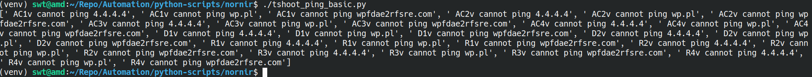

##### linux_ping.py

```python
#!/usr/bin/env python3

"""
Crated by: swietlas
This is script test target devices directly from management PC
"""
import os
import subprocess
#from subprocess import Popen, DEVNULL
from rich import print as rprint

reachable = []
unreachable = []

# Clear output
os.system("clear")
os.system("rm reachable.txt ")
os.system("rm unreachable.txt ")

with open("target_list.txt", "r") as f:
    lines = f.readlines()
    # print("\nTarget hosts:")
    # print(lines)
    # print("*"*30)

for line in lines:
    ipaddr = str(line.rstrip())
    response = subprocess.Popen(["ping", "-c", "3", "-i", "0,2", "-w", "1", ipaddr],
    stdout=subprocess.DEVNULL,
    stderr=subprocess.STDOUT)
    stdout, stderr = response.communicate()

    if response.returncode == 0:
        rprint(f"Target {ipaddr} is [green]reachable[/green]\n")
        reachable.append(line)
        with open("reachable.txt","a") as r_file:
            r_file.write(line)
    else:
        rprint(f"Target {ipaddr} is [red]unreachable[/red]\n")
        unreachable.append(line)
        with open("unreachable.txt","a") as unr_file:
            unr_file.write(line)

```

###### ouput:
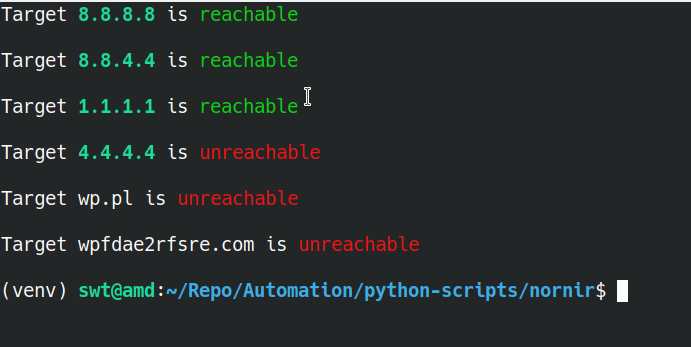


##### List status of interfaces (useful to verify err-disabled ports) tshoot_list_status_of_interfaces.py

```python
"""
Crated by: swietlas

This is script retrieves and processes interface status from Cisco network devices

Don't forget to install scrapli, norninr_scrapli, nornir utils, textfsm and genie
pip install nornir scrapli

pip install nornir
pip install ipdb
pip install rich
pip install scrapli[genie]
pip install nornir
pip install nornir-scrapli
pip install nornir_utils

"""


from nornir import InitNornir
from nornir_scrapli.tasks import send_command
from nornir_utils.plugins.functions import print_result
from nornir_scrapli.functions import print_structured_result
import ipdb
import pprint as pp
from rich import print as rprint
from nornir.core.filter import F
from pprint import pprint
from datetime import datetime
import pathlib
from nornir_utils.plugins.tasks.files import write_file
import getpass


# Declare empty lists for three main port statuses
connected_ports = ["Host,Port,Description"]
notconnected_ports = ["Host,Port,Description"]
err_disabled_ports =["Host,Port,Description"]
disabled_ports = ["Host,Port,Description"]

# Prepare Directory structure
output_dir = "PortStatus"
# datetime object containing current date and time
now = datetime.now()
# dd/mm/YY H:M:S
dt_string = now.strftime("%d-%m-%Y_%H:%M:%S")
date_dir = output_dir + "/" + dt_string
# Make sure all directories exist
pathlib.Path(output_dir).mkdir(exist_ok=True)
pathlib.Path(date_dir).mkdir(exist_ok=True)


# Specify Nornir config file
nr = InitNornir(config_file="config_vios.yaml")
username = input('Enter your username: ')
password = getpass.getpass()
# Task declaration
def show_interfaces(task):
    """
    Nornir Task for retreiving and processing interface status
    """
    intf_status = task.run(task=send_command, command="show interface status")
    task.host["list"] = intf_status.scrapli_response.textfsm_parse_output() 
    interfaces = task.host["list"]
    
    for interface in interfaces:
        port = interface["port"]
        port_status = interface["status"]
        description = interface["name"]
        if port_status == "connected":
            connected_ports.append(f"{task.host},{port},{description}")
        elif port_status == "notconnect":
            notconnected_ports.append(f"{task.host},{port},{description}")
        elif port_status == "err-disabled":
            err_disabled_ports.append(f"{task.host},{port},{description}")
        elif port_status == "disabled":
            disabled_ports.append(f"{task.host},{port},{description}")

def SaveAndPrint(status):
    """
    Function prints the result on screen and save output to respective file
    """
    # Preparing output based on interface status
    if status == "connected":
        print("\n"+"#"*75)
        rprint("[green]CONNECTED[/green]")
        port_list = connected_ports
    elif status == "notconnect":
        print("\n"+"#"*75)
        rprint("[yellow]DISCONNECTED[/yellow]")
        port_list = notconnected_ports
    elif status == "err-disabled":
        print("\n"+"#"*75)
        rprint("[red]ERROR DISABLED[/red]")
        port_list = err_disabled_ports
    elif status == "disabled":
        print("\n"+"#"*75)
        rprint("[medium_purple2]DISABLED[/medium_purple2]")
        port_list = disabled_ports  
    # Save content of given list to file
    with open( f"{date_dir}/{status}.txt", "w") as f:
        for line in port_list:
            print(line)
            f.write(line + "\n")


# Filter target device group
switch_target = nr.filter(F(groups__contains="distribution") | F(groups__contains="access") )
# Run Nornir task via function show_interfaces
results = switch_target.run(task=show_interfaces)

status_list = ["connected","notconnect","err-disabled","disabled"]
for s in status_list:
    SaveAndPrint(s)
print(f"\nPlease find output files in {date_dir} directory")    
```

###### output
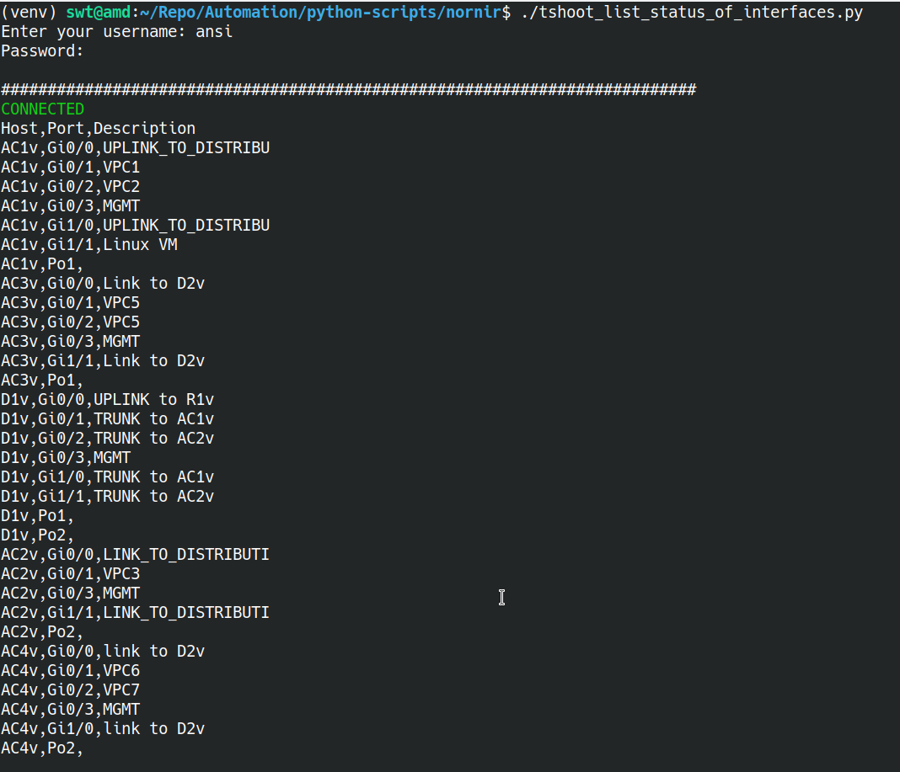
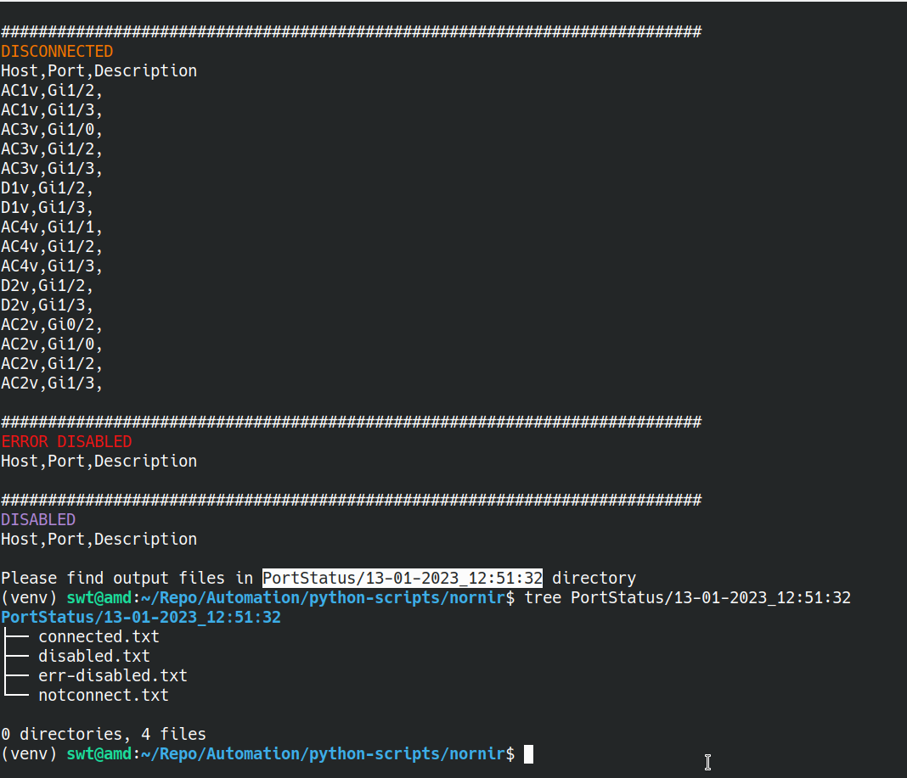

```
(venv) swt@amd:~/Repo/Automation/python-scripts/nornir$ cat PortStatus/13-01-2023_12\:51\:32/notconnect.txt 
Host,Port,Description
AC1v,Gi1/2,
AC1v,Gi1/3,
AC3v,Gi1/0,
AC3v,Gi1/2,
AC3v,Gi1/3,
D1v,Gi1/2,
D1v,Gi1/3,
AC4v,Gi1/1,
AC4v,Gi1/2,
AC4v,Gi1/3,
D2v,Gi1/2,
D2v,Gi1/3,
AC2v,Gi0/2,
AC2v,Gi1/0,
AC2v,Gi1/2,
AC2v,Gi1/3,

```

##### Voice Vlan detection -  tshoot_voice_vlan_detection.py

```python
#!/usr/bin/env python3
"""
Crated by: swietlas

This is script retrieves and processes interface information from Cisco switches ans gather vlan and Voice vlan datea

Don't forget to install scrapli, norninr_scrapli, nornir utils, textfsm and genie
pip install nornir scrapli

pip install nornir
pip install ipdb
pip install rich
pip install scrapli[genie]
pip install nornir
pip install nornir-scrapli
pip install nornir_utils

"""


from nornir import InitNornir
from nornir_scrapli.tasks import send_command
from nornir_utils.plugins.functions import print_result
from nornir_scrapli.functions import print_structured_result
import ipdb
import pprint as pp
from rich import print as rprint
from nornir.core.filter import F
from pprint import pprint
from datetime import datetime
import pathlib
from nornir_utils.plugins.tasks.files import write_file
#import getpass
import threading

# Declare empty lists for three main port statuses
port_list = ["Host,Interface,Description,IPaddr,Protocol-Status,Link-Status,MTU,"]

# Prepare Directory structure
output_dir = "VoiceVLAN"
# datetime object containing current date and time
now = datetime.now()
# dd/mm/YY H:M:S
dt_string = now.strftime("%d-%m-%Y_%H:%M:%S")
date_dir = output_dir + "/" + dt_string
# Make sure all directories exist
pathlib.Path(output_dir).mkdir(exist_ok=True)
pathlib.Path(date_dir).mkdir(exist_ok=True)


# Specify Nornir config file
nr = InitNornir(config_file="config_vios.yaml")

# Uncomment below to enter password manualy
# username = input('Enter your username: ')
# password = getpass.getpass()

LOCK = threading.Lock()

with open(f"{date_dir}/interfaces_with_voice_vlan.csv", "a") as f:
    f.write(f"Host,Interface,Vlan,VoiceVLAN\n")
with open(f"{date_dir}/interfaces_with_no_voice_vlan.csv", "a") as f:    
    f.write(f"Host,Interface,Vlan\n")
with open(f"{date_dir}/trunk_interfaces_.csv", "a") as f:    
    f.write(f"Host,Interface,NativeVLAN,AllowedVLAns\n")
# Task declaration
def show_switchport(task):
    """
    Nornir Task for retreiving and processing interface status
    """
    intf_status = task.run(task=send_command, command="show interfaces switchport")
    task.host["intflist"] = intf_status.scrapli_response.textfsm_parse_output() 
    interfaces = task.host["intflist"]
    
    for interface in interfaces:

        LOCK.acquire()

        port = interface["interface"]
        mode = interface["mode"] # 'mode': 'trunk (member of bundle Po1)','mode': 'static access','mode': 'trunk',  'mode': 'down',
        admin_mode = interface["admin_mode"] # 'admin_mode': 'trunk',  'admin_mode': 'dynamic auto',  'admin_mode': 'static access',
        native_vlan = interface["native_vlan"]
        voice_vlan = interface["voice_vlan"]
        access_vlan = interface["access_vlan"]
        trunking_vlans = interface["trunking_vlans"]

        if mode == 'static access':
            print(f"""
                HOST: {task.host}
                Interface {port} is configured as Access Port
                VLAN: {access_vlan}
                Voice VLAN: {voice_vlan}
                """)

            if voice_vlan != 'none':
                print(voice_vlan)   
                with open(f"{date_dir}/interfaces_with_voice_vlan.csv", "a") as f:
                    f.write(f"{task.host},{port},{access_vlan},{voice_vlan}\n")
            else:
                print(voice_vlan)   
                with open(f"{date_dir}/interfaces_with_no_voice_vlan.csv", "a") as f:
                    f.write(f"{task.host},{port},{access_vlan}\n")

        if mode == 'trunk':
            print(f"""
                HOST: {task.host}
                Interface {port} is configured as TRUNK PORT
                Native VLAN: {native_vlan}
                Allowed VLANS:{trunking_vlans}
            """)

            with open(f"{date_dir}/trunk_interfaces_.csv", "a") as f:    
                f.write(f"{task.host},{port},{native_vlan},{trunking_vlans}\n")

        if "trunk (member of bundle" in mode:
            print(f"""
                HOST: {task.host}
                Interface {port} is configured as Etherchanel and Trunk
                Native VLAN: {native_vlan}
                Allowed VLANS:{trunking_vlans} 
            """)  

            with open(f"{date_dir}/trunk_interfaces_.csv", "a") as f:    
                f.write(f"{task.host},{port},{native_vlan},{trunking_vlans}\n")


        LOCK.release()

# Filter target device group
#switch_target = nr.filter(F(groups__contains="distribution") | F(groups__contains="access") )
# Run Nornir task via function show_interfaces
#results = switch_target.run(task=show_interfaces)
results = nr.run(task=show_switchport)
rprint(f"\nPlease check the output files in [green]{date_dir}[/green] directory\n")

#ipdb.set_trace()
```
###### output


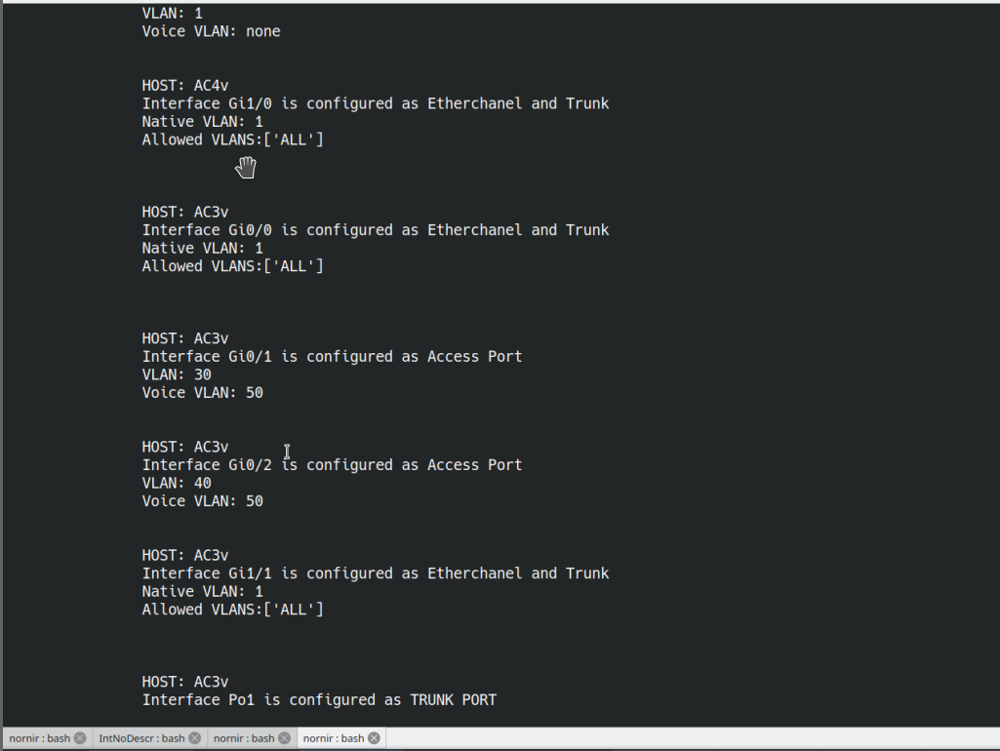
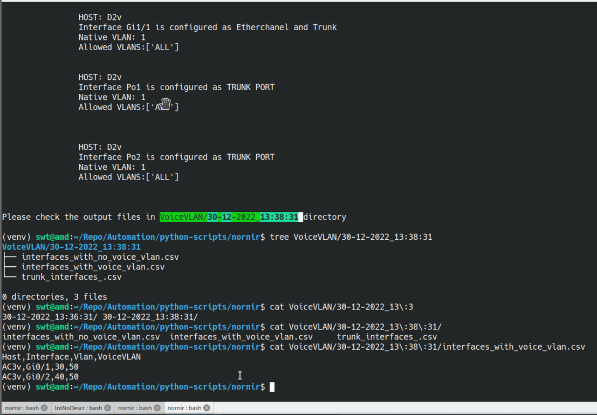

#### Display interfaces status with  tshoot_int_status.py

```python
#!/usr/bin/env python3
"""
Crated by: swietlas

This is script retrieves and processes interface status from Cisco network devices

Don't forget to install scrapli, norninr_scrapli, nornir utils, textfsm and genie
pip install nornir scrapli

pip install nornir
pip install ipdb
pip install rich
pip install scrapli[genie]
pip install nornir
pip install nornir-scrapli
pip install nornir_utils

"""


from nornir import InitNornir
from nornir_scrapli.tasks import send_command
from nornir_utils.plugins.functions import print_result
from nornir_scrapli.functions import print_structured_result
import ipdb
import pprint as pp
from rich import print as rprint
from nornir.core.filter import F
from pprint import pprint
from datetime import datetime
import pathlib
from nornir_utils.plugins.tasks.files import write_file
#import getpass
import threading

# Declare empty lists for three main port statuses
port_list = ["Host,Interface,Description,IPaddr,Protocol-Status,Link-Status,MTU,"]

# Prepare Directory structure
output_dir = "PortSummary"
# datetime object containing current date and time
now = datetime.now()
# dd/mm/YY H:M:S
dt_string = now.strftime("%d-%m-%Y_%H:%M:%S")
date_dir = output_dir + "/" + dt_string
# Make sure all directories exist
pathlib.Path(output_dir).mkdir(exist_ok=True)
pathlib.Path(date_dir).mkdir(exist_ok=True)


# Specify Nornir config file
nr = InitNornir(config_file="config_vios.yaml")

# Uncomment below to enter password manualy
# username = input('Enter your username: ')
# password = getpass.getpass()

LOCK = threading.Lock()

with open(f"{date_dir}/interface-list.csv", "a") as f:
    f.write(f"Host,Interface,Speed,Duplex,Description,IPaddr,Protocol-Status,Link-Status,MTU\n")
# Task declaration
def show_interfaces(task):
    """
    Nornir Task for retreiving and processing interface status
    """
    intf_status = task.run(task=send_command, command="show interfaces")
    task.host["intlist"] = intf_status.scrapli_response.textfsm_parse_output() 
    interfaces = task.host["intlist"]
    
    for interface in interfaces:
        # try:
        LOCK.acquire()
        # except KeyError:
        #     pass
        port = interface["interface"]
        port_status = interface["link_status"]
        protocol_status = interface["protocol_status"] 
        description = interface["description"]
        mac_addr = interface["address"] 
        input_errors = interface["input_errors"] 
        input_packets = interface["input_packets"] 
        mtu = interface["mtu"] 
        output_packets = interface["output_packets"] 
        output_errors = interface["output_errors"] 
        vlan_id = interface["vlan_id"] 
        crc = interface["crc"]
        ip_address= interface["ip_address"]
        speed = interface["speed"]
        duplex = interface["duplex"]
        print(f"""
        HOST: {task.host}
        Interface {port} is {port_status} / {protocol_status},
        Description: {description}
        IP address: {ip_address}
        MAC: {mac_addr}
        MTU: {mtu}
        Input packets: {input_packets} , input errors: {input_errors}
        Output packets:{output_packets}, output errors: {output_errors}
        CRC errors: {crc }
        """)
        #port_list = ["Host,Interface,Description,IPaddr,Protocol-Status,Link-Status,MTU,"]
        port_list.append(f"['{task.host}','{port}','{speed}','{duplex}' ,'{description}','{ip_address}','{protocol_status}','{port_status}','{mtu}']")
        with open(f"{date_dir}/interface-list.csv", "a") as f:
            f.write(f"{task.host},{port},{speed},{duplex},{description},{ip_address},{protocol_status},{port_status},{mtu}\n")
        LOCK.release()
        #no_description.append(f"['{task.host}','{port}']")
# Filter target device group
#switch_target = nr.filter(F(groups__contains="distribution") | F(groups__contains="access") )
# Run Nornir task via function show_interfaces
#results = switch_target.run(task=show_interfaces)
results = nr.run(task=show_interfaces)
print(f"\nPlease check the output in {date_dir}/interface-list.csv File\n")
#print_result(results)

```
###### output
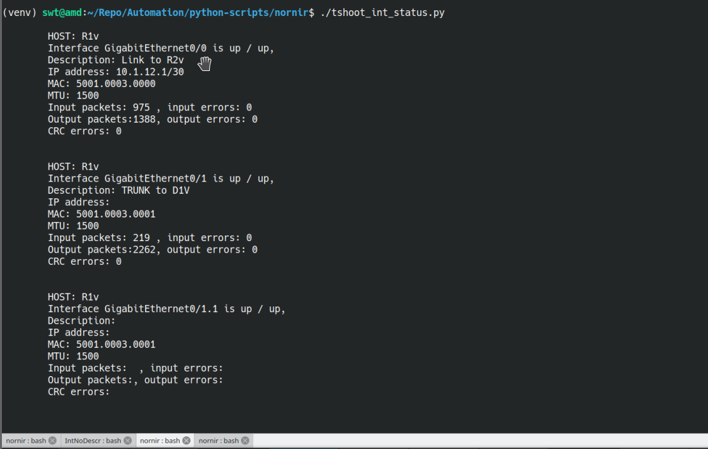
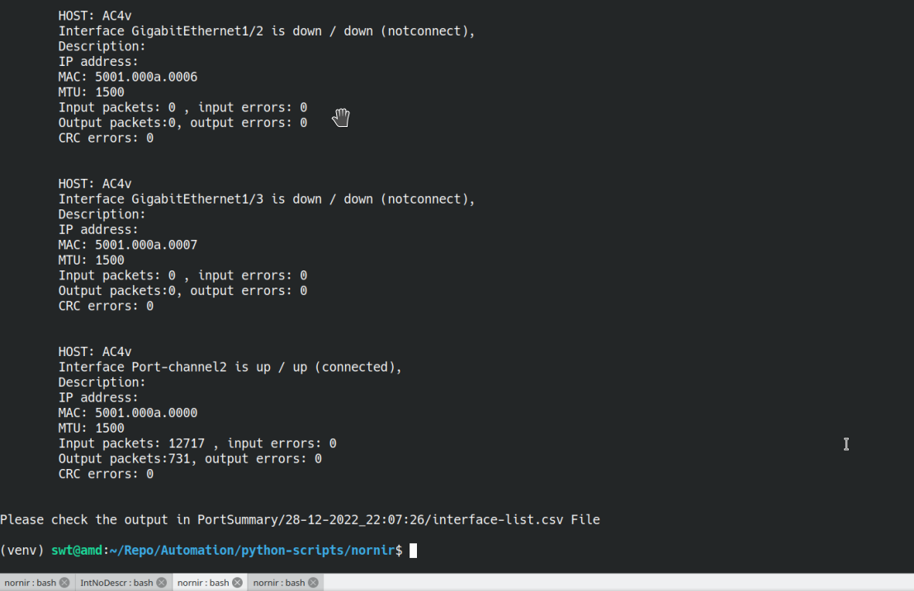
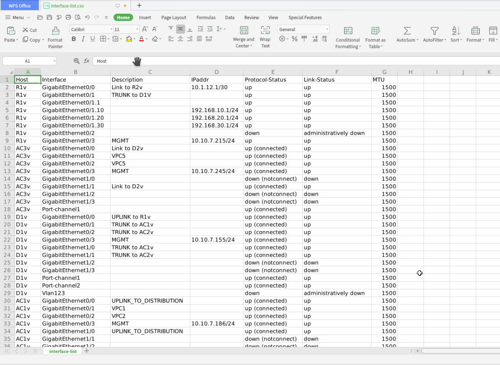


##### Shutdown ports with no description - tshoot_int_no_descr_mark_shut.py

```python
#!/usr/bin/env python3
"""
Crated by: swietlas

This is script retrieves interface information using "show interface description" command
and processes gathered data in order to select interfaces without description.
Then it adds description "Disabled by Admin" and shutdown all portrs in scope.

Don't forget to install scrapli, norninr_scrapli, nornir utils, textfsm and genie
pip install nornir scrapli

pip install nornir
pip install ipdb
pip install rich
pip install scrapli[genie]
pip install nornir
pip install nornir-scrapli
pip install nornir_utils

"""

import csv
from nornir import InitNornir
from nornir_scrapli.tasks import send_command,send_configs
from nornir_scrapli.functions import print_structured_result
import ipdb
from rich import print as rprint
from nornir.core.filter import F
from pprint import pprint
from datetime import datetime
import pathlib
#from nornir_utils.plugins.tasks.files import write_file
#import getpass
import threading

# Prepare Directory structure
output_dir = "IntNoDescr"
# datetime object containing current date and time
now = datetime.now()
# dd/mm/YY H:M:S
dt_string = now.strftime("%d-%m-%Y_%H:%M:%S")
date_dir = output_dir + "/" + dt_string
# Make sure all directories exist
pathlib.Path(output_dir).mkdir(exist_ok=True)
pathlib.Path(date_dir).mkdir(exist_ok=True)


# Specify Nornir config file
nr = InitNornir(config_file="config_vios.yaml")

# Uncomment below to enter password manualy
# username = input('Enter your username: ')
# password = getpass.getpass()

no_description = []
LOCK = threading.Lock()
# Task declaration
def show_interfaces(task):
    """
    Nornir Task for retreiving and processing interface status
    """
    intf_status = task.run(task=send_command, command="show interfaces description")
    task.host["intlist"] = intf_status.scrapli_response.textfsm_parse_output() 
    interfaces = task.host["intlist"]
    
    for interface in interfaces:
        LOCK.acquire()
        port = interface["port"]
        protocol = interface["protocol"]
        status = interface["status"]
        description = interface["descrip"]
        intf = port
        if ("Po" in port or "." in port or "Vl" in port or "Lo" in port ):
            rprint(f"[yellow]{task.host}: Ignoring logical interface {port} [/yellow]")
        elif description == "":
            if protocol == "up":
                rprint(f"[red]{task.host}:  {port} has no Description and is in {protocol}/{status} [/red]")
            else:
                rprint(f"[medium_purple2]{task.host}:  {port} has no Description and is in {protocol}/{status} [/medium_purple2]")
            # For debugging purpose script saves ports which should be disabled in CSV format    
            with open( f"{date_dir}/ports_to_shut.csv", "a") as f:
                f.write(f"{task.host},{port}\n")
                no_description.append(f"['{task.host}','{port}']")
                command_list = [ str("interface" +" " +  port),"shutdown","description Disabled by Admin"]
                disable_unused(task, command_list )
                # disable_unused(task, port,command_list )
        else:    
            rprint(f"[green]{task.host}:  {port} has following Description: {description} And is in {protocol}/{status}[/green] ")
        LOCK.release()

def disable_unused(task,input_list):
    task.run(task=send_configs, name="disable interfaces", configs=input_list,)


# In order to filter target device group please uncomment and adjust accordingly
# switch_target = nr.filter(F(groups__contains="distribution") | F(groups__contains="access") )
# Run Nornir task via function show_interfaces
# results = switch_target.run(task=show_interfaces)
print("#"*75)
print("Retrieving and processing interface information")
print("#"*75)
results = nr.run(task=show_interfaces)
print("#"*75)
print("List of ports to be disabled")
print("#"*75)
pprint(no_description)

```

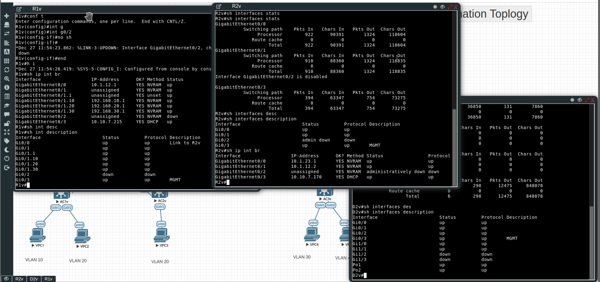
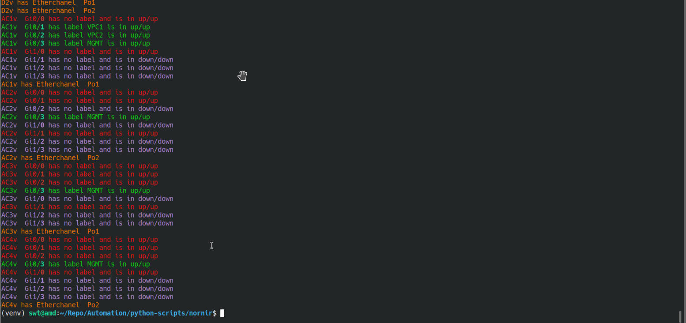
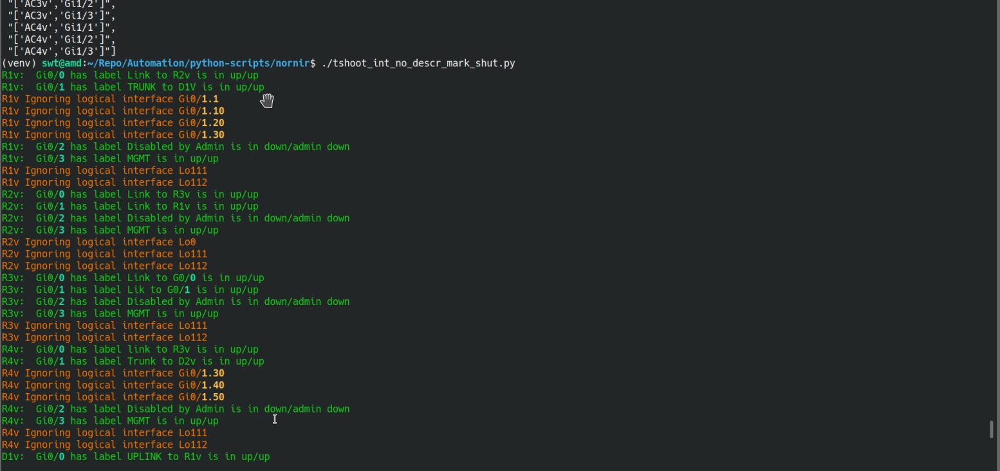
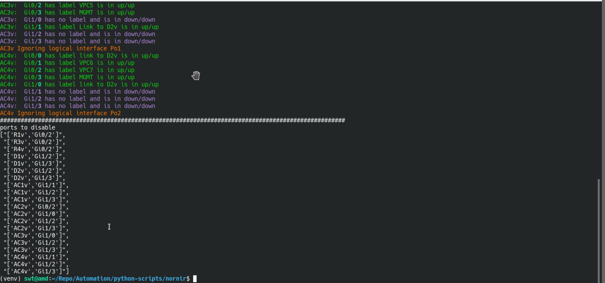
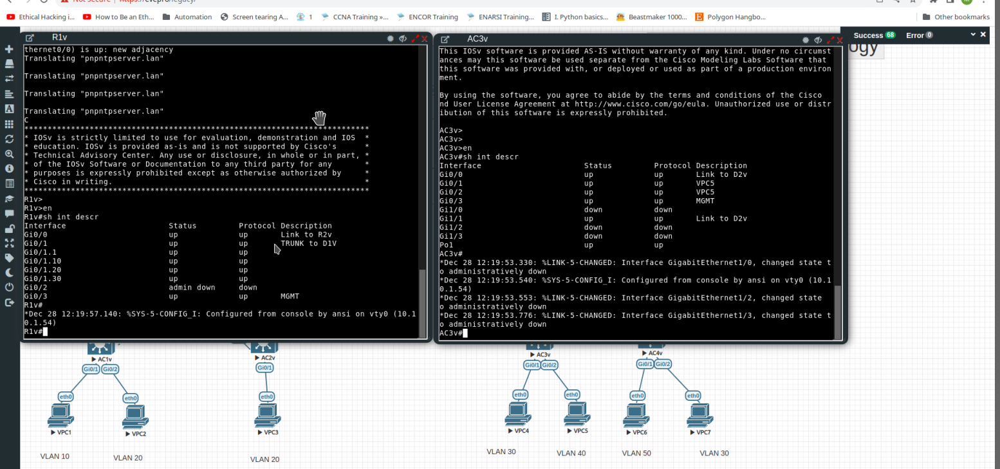
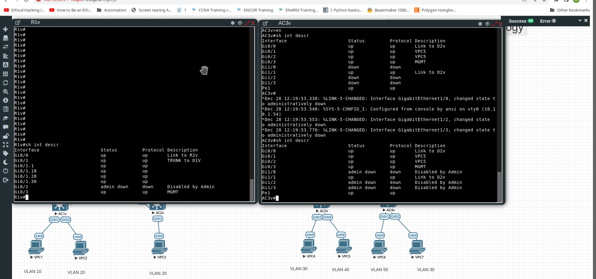
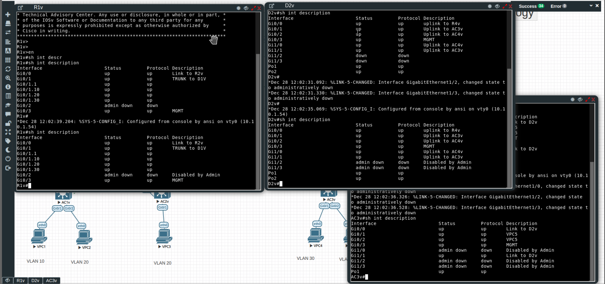
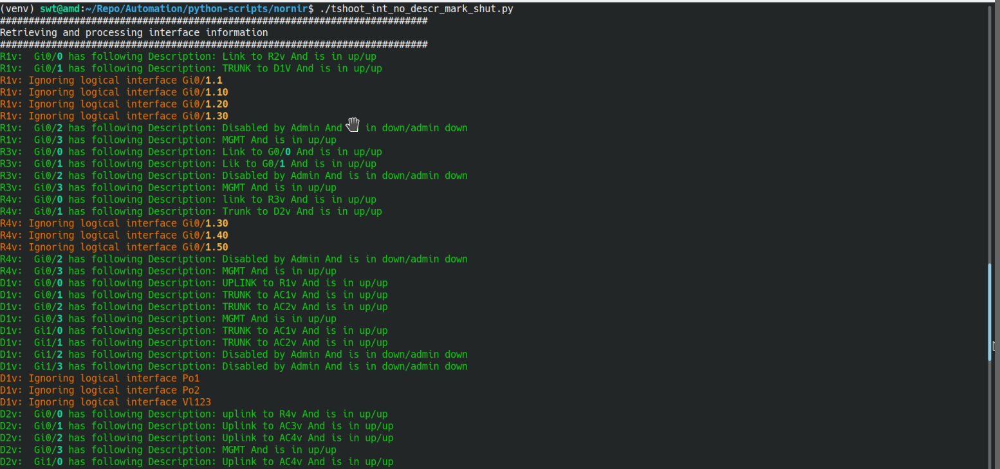
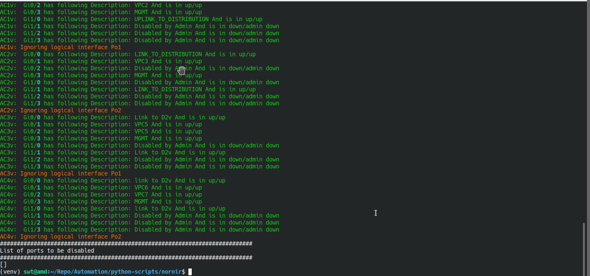


#### Hardware info - tshoot_get_device_info.py

```python
#!/usr/bin/env python3
"""
Crated by: swietlas

This is script retrieves and processes interface status from Cisco network devicess

Don't forget to install scrapli, norninr_scrapli, nornir utils, textfsm and genie
pip install nornir scrapli

pip install nornir
pip install ipdb
pip install rich
pip install scrapli[genie]
pip install nornir
pip install nornir-scrapli
pip install nornir_utils

"""
from nornir import InitNornir
from nornir_scrapli.tasks import send_command
from nornir_scrapli.functions import print_structured_result
from nornir_utils.plugins.functions import print_result
import pprint as pp
from rich import print as rprint
from datetime import datetime
import pathlib
import ipdb
import genie

# Prepare Directory structure
output_dir = "DevicesInfo"
# datetime object containing current date and time
now = datetime.now()
# dd/mm/YY H:M:S
dt_string = now.strftime("%d-%m-%Y_%H:%M:%S")
date_dir = output_dir + "/" + dt_string
# Make sure all directories exist
pathlib.Path(output_dir).mkdir(exist_ok=True)
pathlib.Path(date_dir).mkdir(exist_ok=True)

# Specify Nornir config file
nr = InitNornir(config_file="config_vios.yaml")

# Prompt for credential
# username = input('Enter your username: ')
# password = getpass.getpass()

# Set Header line for CSV file
with open(f"{date_dir}/inventory.csv", "a") as f:
    f.write(f"Host,Chassis,Chassis_SN,Platform,DeviceType,SystemImage,Version,Version_Short,Release,Uptime,DRAMsize,FlashSize\n")
rprint("[yellow]Connecting to all devices in scope and collecting inventory information - please wait[/yellow]\n")

# Define Norninr taks
def get_facts(task):
    collected = task.run(task=send_command, command="show version")
    task.host["facts"] = collected.scrapli_response.genie_parse_output()
    device = task.host["facts"]["version"]
    chassis = device["chassis"]
    chassis_sn = device["chassis_sn"]
    flash = device["mem_size"]["non-volatile configuration"]
    DRAM = device["main_mem"]
    device_type = device["rtr_type"]
    system_image = device["system_image"]
    platform = device["platform"]
    uptime = device["uptime"]
    uptime = uptime.replace(","," ") # this removes comma from uptime string 'uptime': '2 hours, 4 minutes'
    version = device["version"]
    version_sort = device["version_short"]
    release = device["label"]
    # Save to file
    with open(f"{date_dir}/inventory.csv", "a") as f:
        f.write(f"{task.host},{chassis},{chassis_sn},{platform},{device_type},{system_image},{version},{version_sort},{release},{uptime},{DRAM},{flash}\n")

# Run Nornir task
result = nr.run(task=get_facts)
# Print location of target file
rprint(f"\nPlease find target inventory file here:  [green]'{date_dir}/inventory.csv'[/green] \n")
#print_structured_result(result)

#ipdb.set_trace()

```
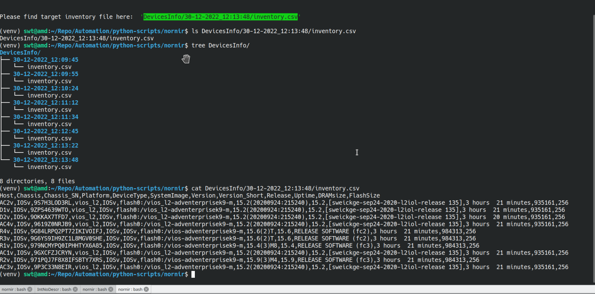
```
(venv) swt@amd:~/Repo/Automation/python-scripts/nornir$ cat DevicesInfo/02-01-2023_09\:22\:13/inventory.csv
```

```csv
Host,Chassis,Chassis_SN,Platform,DeviceType,SystemImage,Version,Version_Short,Release,Uptime,DRAMsize,FlashSize
AC3v,IOSv,9P3C33N8EIR,vios_l2,IOSv,flash0:/vios_l2-adventerprisek9-m,15.2(20200924:215240),15.2,[sweickge-sep24-2020-l2iol-release 135],9 minutes,935161,256
D2v,IOSv,9OKKAX7TFD7,vios_l2,IOSv,flash0:/vios_l2-adventerprisek9-m,15.2(20200924:215240),15.2,[sweickge-sep24-2020-l2iol-release 135],9 minutes,935161,256
R2v,IOSv,971PQJ7F8X8IFSBTY7XRS,IOSv,IOSv,flash0:/vios-adventerprisek9-m,15.9(3)M4,15.9,RELEASE SOFTWARE (fc3),9 minutes,984313,256
R1v,IOSv,979NCMYPQ0IPHHTYX6A85,IOSv,IOSv,flash0:/vios-adventerprisek9-m,15.4(3)M8,15.4,RELEASE SOFTWARE (fc3),9 minutes,984313,256
R4v,IOSv,9G84LRPQ2PT72IKIVOIFJ,IOSv,IOSv,flash0:/vios-adventerprisek9-m,15.6(2)T,15.6,RELEASE SOFTWARE (fc2),9 minutes,984313,256
R3v,IOSv,9G6YS9IH9ZC1L8MGV0SHE,IOSv,IOSv,flash0:/vios-adventerprisek9-m,15.6(2)T,15.6,RELEASE SOFTWARE (fc2),9 minutes,984313,256
AC1v,IOSv,9GXCFZJCRYN,vios_l2,IOSv,flash0:/vios_l2-adventerprisek9-m,15.2(20200924:215240),15.2,[sweickge-sep24-2020-l2iol-release 135],9 minutes,935161,256
D1v,IOSv,9ZPS4639WTO,vios_l2,IOSv,flash0:/vios_l2-adventerprisek9-m,15.2(20200924:215240),15.2,[sweickge-sep24-2020-l2iol-release 135],9 minutes,935161,256
AC4v,IOSv,9619Z0NRJB9,vios_l2,IOSv,flash0:/vios_l2-adventerprisek9-m,15.2(20200924:215240),15.2,[sweickge-sep24-2020-l2iol-release 135],9 minutes,935161,256
AC2v,IOSv,9S7H3LOD3RL,vios_l2,IOSv,flash0:/vios_l2-adventerprisek9-m,15.2(20200924:215240),15.2,[sweickge-sep24-2020-l2iol-release 135],9 minutes,935161,256
HQ,C1861-UC-2BRI-K9,FTX132383BT,C1861,C1861-UC-2BRI-K9,flash:c1861-adventerprisek9-mz.152-4.M11.bin,15.2(4)M11,15.2,RELEASE SOFTWARE (fc2),25 minutes,235520,128

```

#### Creating backups for all inventory devices - oper-backup.py 

```python
'''
Created by swietlas

This scripts creates backup of running config for IOS and IOSXE devices

'''

from nornir import InitNornir
from nornir_napalm.plugins.tasks import napalm_get
from nornir_utils.plugins.functions import print_result
from nornir_utils.plugins.tasks.files import write_file
import pathlib
from datetime import datetime


nr = InitNornir(config_file="config_vios.yaml")

def prepare_dirs():
    # Prepare Directory structure
    output_dir = "Backups"
    # datetime object containing current date and time
    now = datetime.now()
    # dd/mm/YY H:M:S
    dt_string = now.strftime("%d-%m-%Y_%H:%M:%S")
    date_dir = output_dir + "/" + dt_string
    # Make sure all directories exist
    pathlib.Path(output_dir).mkdir(exist_ok=True)
    pathlib.Path(date_dir).mkdir(exist_ok=True)
    return date_dir

def backup_configs(task,config_dir):
    cfg_result = task.run(task=napalm_get, getters=["config"])
    startup_cfg = cfg_result.result["config"]["running"]
    task.run(task=write_file, content=startup_cfg, filename=f"{date_result}/{task.host}.cfg")

print("\n[Step 1] Maing sure directory structure exists\n")
date_result = prepare_dirs()
# calling napalm task
print("[Step 2] Running Norninr tasks\n")
results = nr.run(task=backup_configs, config_dir=date_result)
# optionally you can print output to screen
#print_result(results)
print(f"[Completed] You can find backup files in {date_result}")
```
##### output

```
(venv) swt@amd:~/Repo/Automation/python-scripts/nornir$ ./oper-backup.py                

[Step 1] Ensuring directory structure exists

[Step 2] Running Norninr tasks

[Completed] You can find backup files in Backups/13-01-2023_22:24:13
(venv) swt@amd:~/Repo/Automation/python-scripts/nornir$ tree Backups/
Backups/
├── 13-01-2023_22:13:30
│   ├── AC1v.cfg
│   ├── AC2v.cfg
│   ├── AC3v.cfg
│   ├── AC4v.cfg
│   ├── D1v.cfg
│   ├── D2v.cfg
│   ├── R1v.cfg
│   ├── R2v.cfg
│   ├── R3v.cfg
│   └── R4v.cfg
├── 13-01-2023_22:14:46
│   ├── AC1v.cfg
│   ├── AC2v.cfg
│   ├── AC3v.cfg
│   ├── AC4v.cfg
│   ├── D1v.cfg
│   ├── D2v.cfg
│   ├── R1v.cfg
│   ├── R2v.cfg
│   ├── R3v.cfg
│   └── R4v.cfg

```